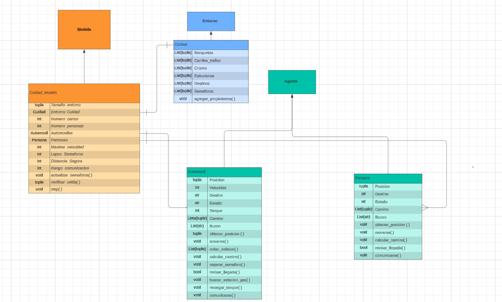
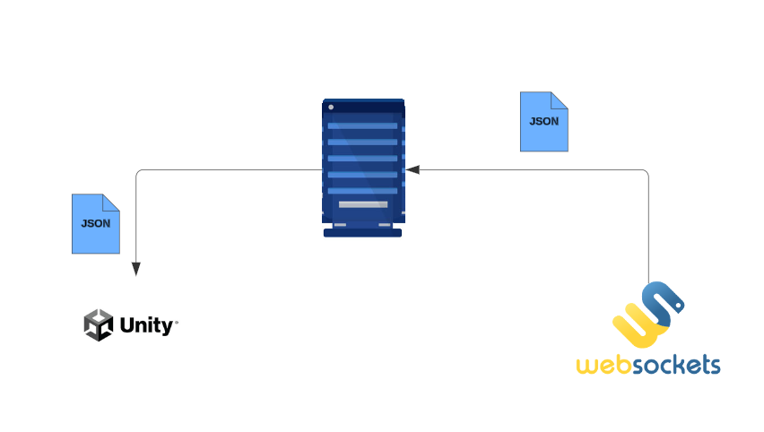
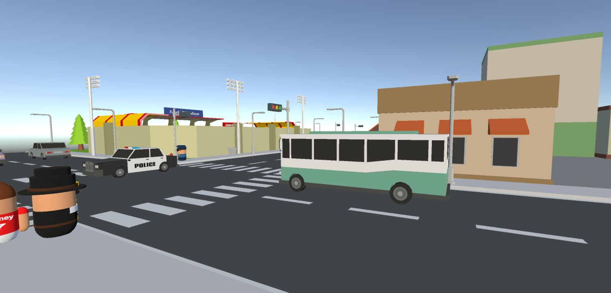
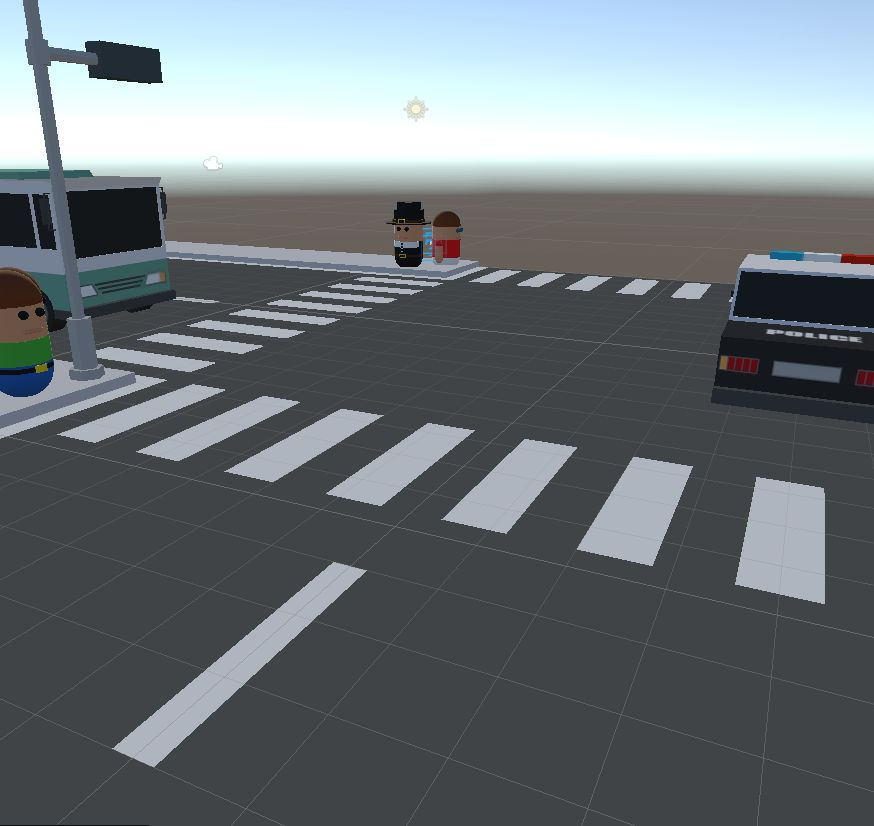
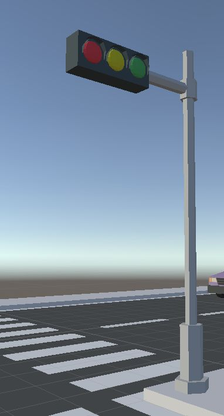

# Simulacion Movilidad Urbana 
Modelación de sistemas multiagentes con gráficas computacionales TC2008B

##  Índice 

- [Introduccion](#introduccion)
- [Instalacion](#instalacion)
- [Uso](#uso)
- [Funcionamiento del Codigo](#funcionamiento-del-codigo)
- [Autores](#autores)

## Introduccion

En las cuidades modernas, los peatones enfretan obstaculos que comprometen su movilidad, seguridad y accesbilidad, especialmente en entornos donde interactuan con vehiculos por lo que se requiere una infraestructura y comunicacion adecuada.Por lo que la simulación busca representar y analizar el comportamiento de tráfico vehicular y peatonal en un entorno urbano controlado, incorporando semáforos, cruces peatonales y diferentes tipos de obstáculos. El objetivo es modelar interacciones realistas entre agentes (vehículos, peatones, semáforos) y el entorno para mejorar la gestión del tráfico y reducir posibles conflictos.

## Instalacion

        git clone git@github.com:MiguelCabreraVictoria/Equipo1_TC2008B.git

### Requisitos 

- [Entorno Virtual Python](https://docs.python.org/es/3.13/tutorial/venv.html)
    - [AgentPy](https://agentpy.readthedocs.io/en/latest/installation.html)   
    - [WebSockets](https://websockets.readthedocs.io/en/stable/index.html)

- Unity Version-6000
    - [ProBuilder](https://docs.unity3d.com/Packages/com.unity.probuilder@4.0/manual/installing.html) 
    - [Nuget](https://github.com/GlitchEnzo/NuGetForUnity)
    - [NewtonSoft](https://docs.unity3d.com/Packages/com.unity.nuget.newtonsoft-json@2.0/manual/index.html)

## Uso 

        source MODELO_CUIDAD/setup.sh 

        > Abrir la carpeta City en Unity
            - Ejecutar el proyecto 

        python Web-Socket/python_client.py
        

## Funcionamiento del Codigo

#### Diagrama de clases

#### Protocolos de interaccion ( Comunicacion bidireccional )

#### Simulacion en Unity

## Autores

- Miguel Angel Cabrera Victoria

- Julia María Stephanie Duenkelsbuehler Castillo

- Elit Shadday Acosta Pastrana
